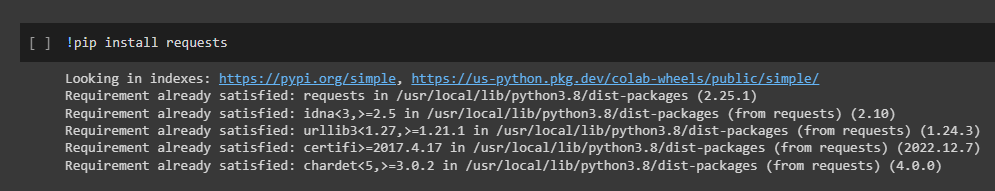
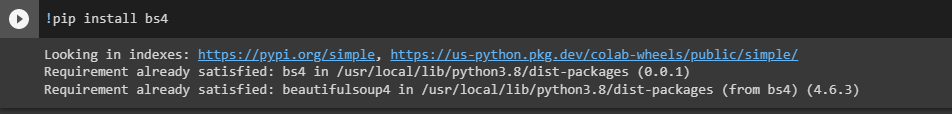
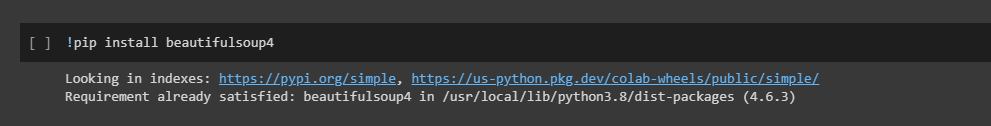
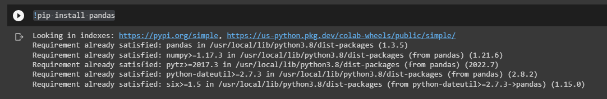
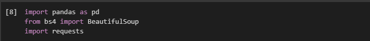
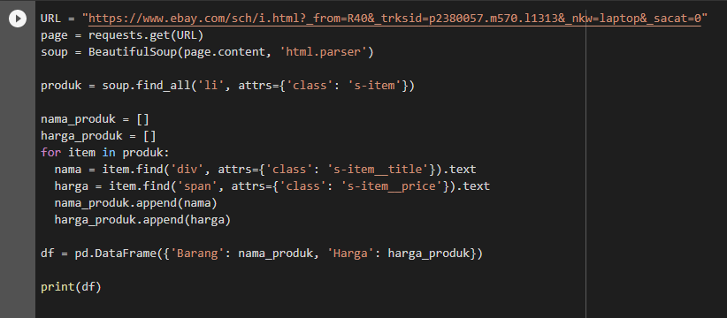
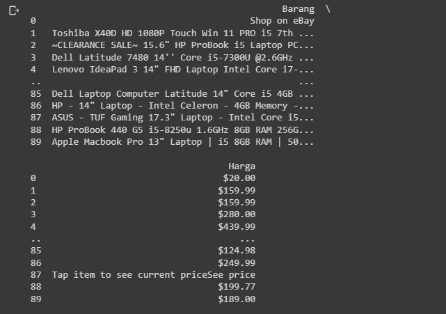

Nama: Muhammad Zidan Fadillah

NIM : 312210277

KELAS : TI 22 A.2

# PRAKTIKUM 11

# Web Scraping Menggunakan Python

- untuk melakukan scrapping web kita memerlukan beberapa library dalam python diantaranya adalah request pandas beautifulsoup bs4

# Instal Library request

- ketika kita ingin menginstal nya cukup menggunakan perintah seperti di bawah ini

- pip install request

# instal Library bs4

- Ketika kita ingin menginstal nya cukup menggunakan perintah seperti di bawah ini

- pip install bs4

# instal Library BeautifulSoup4

- ketika kita ingin menginstal nya cukup menggunakan perintah seperti di bawah ini

- pip install BeautifulSoup4

# Instal Library Pandas

- ketika kita ingin menginstal nya cukup menggunakan perintah seperti dibawah ini

- pip install pandas

# sebelum menjalankan program utama kita harus menggunakan perintah seperti di bawah ini

- import pandas as pd

- form bs4 import BeautifulSoup

- import requests

# Web scraping

# penjelasan

- dengan menggunakan web marketplace Ebay lalu saya salin ke link variabel

- lalu saya gunakan soup untuk menganalisis konten dengan html untuk pencarian produk

- buat list kemudian tambahkan list tersebut

- buat dataframe untuk list

